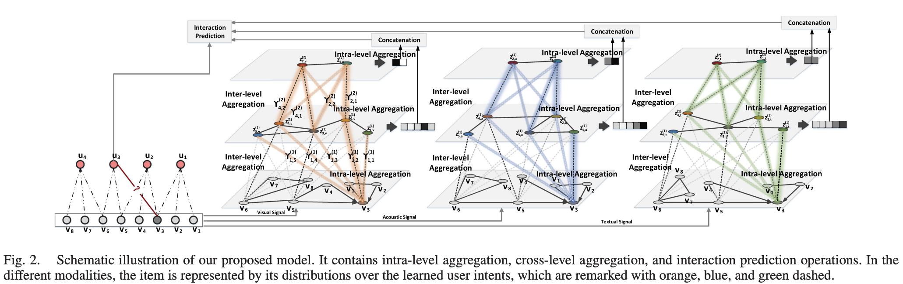

# Hierarchical User Intent Graph Network for Multimedia Recommendation

> A novel framework that learns multi-level user intents from co-interacted patterns of items, exhibiting user intents in a hierarchical graph structure to enhance multimedia recommendation.

## Authors

**Yinwei Wei**\*, **Xiang Wang**, **Xiangnan He**, **Liqiang Nie**, **Yong Rui**, **Tat-Seng Chua**

\* Corresponding author (weiyinwei at hotmail.com)

## Links

- **Paper**: [`TMM'21`](https://ieeexplore.ieee.org/abstract/document/9453189/)
- **Code Repository**: [`GitHub`](https://github.com/iLearn-Lab/TMM21-HUIGN)

---

## Updates

- [10/2021] Paper released on arXiv and accepted to IEEE Transactions on Multimedia (TMM).

---

## Introduction

This is the official PyTorch implementation for the paper **Hierarchical User Intent Graph Network for Multimedia Recommendation**.

Understanding user preference on item context is the key to acquiring high-quality multimedia recommendations. However, present works largely leave user intents untouched. In this work, we aim to learn multi-level user intents from the co-interacted patterns of items to obtain high-quality representations of users and items. 

We develop a novel framework, **Hierarchical User Intent Graph Network (HUIGN)**, which exhibits user intents in a hierarchical graph structure, from fine-grained to coarse-grained intents. It utilizes intra-level and inter-level aggregations to model user behaviors and refine representations as a distribution over discovered intents, achieving significant improvements over state-of-the-art methods like MMGCN and DisenGCN.

---

## Highlights

- Proposes a novel **Hierarchical User Intent Graph Network** to explicitly model multi-level user intents.
- Employs **intra-level aggregation** to distill intent signals and **inter-level aggregation** to model coarser-grained supernodes.
- Refines user and item representations as a distribution over discovered intents rather than relying solely on pre-existing features.
- Provides semantic visualization of user intents through item representations.

---

## Method / Framework




---

## Installation

The code has been tested running under **Python 3.5.2**. The required packages are as follows:

- Pytorch == 1.1.0
- torch-cluster == 1.4.2
- torch-geometric == 1.2.1
- torch-scatter == 1.2.0
- torch-sparse == 0.4.0
- numpy == 1.16.0

---

## Dataset / Benchmark

We provide and test our model on three processed datasets: **Movielens**, **Tiktok**, and **Kwai**.

- You can find the full version of recommendation datasets via their official platforms (Kwai, Tiktok, and Movielens).

### File Descriptions

- `train.npy`: Train file. Each line is a pair of one user and one of her/his positive items: `(userID, micro-video ID)`.
- `val_full.npy`: Validation file. Each line is a user with her/his positive interactions with items: `(userID, micro-video ID)`.
- `test_full.npy`: Test file. Each line is a user with her/his positive interactions with items: `(userID, micro-video ID)`.

---

## Usage

The instruction of commands has been clearly stated in the codes. Run the following examples to start training the model on different datasets:

### Movielens Dataset

`python main.py --data_path 'Movielens' --l_r 0.0001 --weight_decay 0.0001 --batch_size 1024 --dim_x 64 --num_workers 30 --topK 10 --cluster_list 32 8 4`

### Tiktok Dataset

`python train.py --data_path 'Tiktok' --l_r 0.0005 --weight_decay 0.1 --batch_size 1024 --dim_latent 64 --num_workers 30 --topK 10 --cluster_list 32 8 4`

### Kwai Dataset

`python train.py --data_path 'Kwai' --l_r 0.0005 --weight_decay 0.1 --batch_size 1024 --dim_latent 64 --num_workers 30 --topK 10 --cluster_list 32 8 4`

Citation
If you use this code or our proposed model in your research, please consider citing:

```
@article{wei2021hierarchical,
  title={Hierarchical User Intent Graph Network for Multimedia Recommendation},
  author={Wei, Yinwei and Wang, Xiang   and He, Xiangnan and Nie, Liqiang and Rui, Yong and Chua, Tat-Seng},
  journal={IEEE Transactions on Multimedia},
  year={2021},
  publisher={IEEE}
}

```
